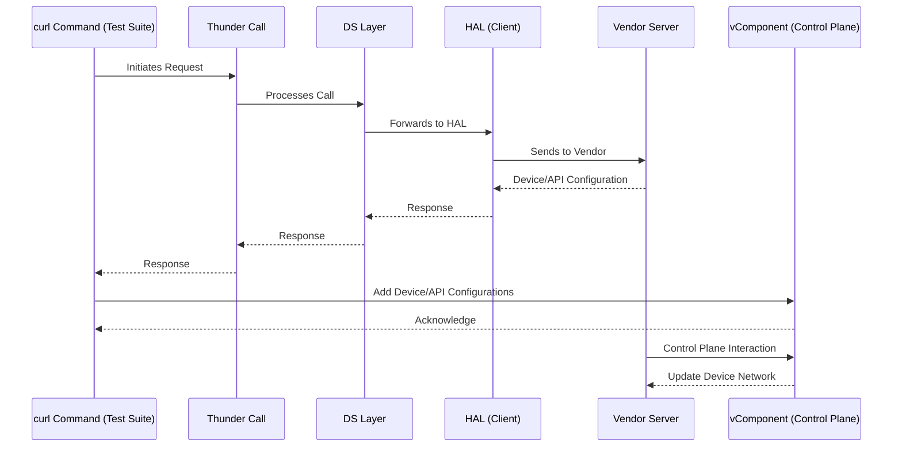

# HDMI CEC vComponent Design Document

## Table of Contents

- [Acronyms, Terms and Abbreviations](#acronyms-terms-and-abbreviations)
- [Introduction](#introduction)
- [Sequence Flow](#sequence-flow)
- [Control Plane Commands](#control-plane-commands)
- [CEC Command–Response Mapping](#cec-commandresponse-mapping-yaml)
- [References](#references)

## Acronyms, Terms and Abbreviations

- `HAL`    - Hardware Abstraction Layer
- `API`    - Application Programming Interface
- `AIDL`   - Android Interface Definition Language
- `VTS`    - Vendor Test Suite
- `HDMI`   - High-Definition Multimedia Interface
- `CEC`    - Consumer Electronics Control
- `YAML`   - Yet Another Markup Language

## Introduction

The `HDMI` `CEC` vComponent is a virtual service that simulates an `HDMI` `CEC` device network.

It is designed to:

- Receive control/configuration commands from the vDevice Controller via the Control Plane.

- Expose a `HDMI` `CEC` `HAL` interface to clients (such as `VTS`) via `AIDL`.

- Process and respond to `CEC` messages according to predefined behaviour defined in `YAML` configuration files.

This allows integration testing, validation, and automation without requiring physical `HDMI` `CEC` hardware.

## Sequence Flow

This section illustrates the typical interaction sequence between the client (such as `VTS`), the `AIDL` interface, the `HDMI` `CEC` vComponent service, the Control Plane, and the vDevice Controller. The flow diagram below details the configuration, registration, message exchange, and device management steps involved in simulating an `HDMI` `CEC` device network for integration testing and validation.



## Control Plane Commands

The Control Plane sends messages to the vComponent in `YAML` format.
These commands configure and update the internal `HDMI`-`CEC` device network maintained by vComponent.
Each command is identified by the `hdmicec.command` field and has associated parameters.

### Supported Commands

#### Device Network Configuration

- **Command:** `configure`
- **Purpose:** Initialize the `HDMI` `CEC` device network and vComponent device details.
- **Action in vComponent:**
    - Creates the root emulated device (e.g., TV).
    - Builds the initial device network hierarchy with connected child devices.
    - Resets any previous network state.
- **YAML Example:** [hdmicec_device_config_add_network.yaml](../../vcomponent_configurations/commands/hdmicec_device_config_add_network.yaml), [hdmicec_device_config.yaml](../../vcomponent_configurations/commands/hdmicec_device_config.yaml)

```yaml
HdmiCec:
  command: configure
  description: Initialize HDMI CEC device map
  config:
    emulated_device:
      name: "VTV"
      language: "eng"
      cec_version: "1.4"
      device_type: "TV"
      power_status: "on"
      port_id: 0
      fault: no
      number_of_ports: 4
      active_source: false
    device_map:
      - device:
        name: "VTV"
        language: "eng"
        cec_version: "1.4"
        device_type: "TV"
        power_status: "on"
        fault: no
        port_id: 0
        number_of_ports: 4
        active_source: false
        children:
          - device:
            name: "YAMAHA"
            language: "eng"
            cec_version: "1.4"
            device_type: "AudioSystem"
            power_status: "on"
            fault: no
            port_id: 3
            number_of_ports: 2
            active_source: false
            children: []
```
- **YAML Field Descriptions**
  - **HdmiCec:** The root key for all HDMI CEC control plane commands.
  - **command:**  The action to be performed by the vComponent (e.g., `configure`, `add_device`, `remove_device`, `update_device_status`).
  - **config:**
  (For `configure` command) Contains the initial configuration for the emulated device and the device network.

    - **emulated_device:**
      The root device to be emulated
      - **name:** Name of the device.
      - **language:** Language code (e.g.,`eng`).
      - **cec_version:** HDMI CEC version (`unknown`, `1.2`, `1.2a`, `1.3`, `1.3a`, `1.4`, `2.0`).
      - **device_type:** Type of device (`TV`, `PlaybackDevice`, `AudioSystem`, `RecordingDevice`, `Tuner`, `Reserved`).
      - **power_status:** Power state (`on`, `standby`, `standbyToOn`, `OnToStandby`).
      - **port_id:** Port number for the device.
      - **fault:** Fault status (`yes`, `partial`, `no`).
      - **number_of_ports:** Number of HDMI ports.
      - **active_source:** Whether the device is the active source (`true`/`false`).

    - **device_map:**
      List of devices in the network, each with the same fields as `emulated_device`, plus:
      - **children:** List of child devices (recursive structure).
#### Add Device to Network

- **Command:** `add_device`
- **Purpose**: Add a new `HDMI` `CEC` device under an existing parent in the device network.
- **Action in vComponent:**
    - Creates and attaches a new virtual device.
    - Updates internal network topology.
- **YAML Example:** [hdmicec_device_add.yaml](../../vcomponent_configurations/commands/hdmicec_device_add.yaml)
```yaml
HdmiCec:
  command: add_device
  description: Add a new HDMI CEC device to the device map
  device:
    name: "GameConsole"
    parent: "VTV"
    language: "eng"
    cec_version: "1.4"
    device_type: "PlaybackDevice"
    power_status: on
    fault: no
    port_id: 1
    number_of_ports: 0
    active_source: false
```

- **YAML Field Descriptions**
  - **HdmiCec:** The root key for all HDMI CEC control plane commands.
  - **command:**  The action to be performed by the vComponent.
    - **device:**
      - **name:** Name of the device.
      - **language:** Language code (e.g.,`eng`).
      - **cec_version:** HDMI CEC version (`unknown`, `1.2`, `1.2a`, `1.3`, `1.3a`, `1.4`, `2.0`).
      - **device_type:** Type of device (`TV`, `PlaybackDevice`, `AudioSystem`, `RecordingDevice`, `Tuner`, `Reserved`).
      - **power_status:** Power state (`on`, `standby`, `standbyToOn`, `OnToStandby`).
      - **port_id:** Port number for the device.
      - **fault:** Fault status (`yes`, `partial`, `no`).
      - **number_of_ports:** Number of HDMI ports.
      - **active_source:** Whether the device is the active source (`true`/`false`).

#### Remove Device from Network

- **Command:** `remove_device`
- **Purpose**: Remove an existing `HDMI` `CEC` device from the device network.
- **Action in vComponent:**
    - Locates the device by name.
    - Removes it from the network hierarchy.
- **YAML Example:** [hdmicec_device_remove.yaml](../../vcomponent_configurations/commands/hdmicec_device_remove.yaml)
```yaml
HdmiCec:
  command: remove_device
  description: Remove an HDMI CEC device from the device network
  device:
    name: "GameConsole"
```
- **YAML Field Descriptions**
  - **HdmiCec:** The root key for all HDMI CEC control plane commands.
  - **command:**  The action to be performed by the vComponent.
  - **device.name:** Name of the device to be removed from the network

#### Update Device Status

- **Command:** `update_device_status`
- **Purpose**: Updates the power status and device status of an existing device.
- **Action in vComponent:**
    - Locates the device by name.
    - Updates power status, fault state.
- **YAML Example:** [hdmicec_device_status.yaml](../../vcomponent_configurations/commands/hdmicec_device_status.yaml)
```yaml
HdmiCec:
  command: update_device_status
  description: Updates the status of an HDMI CEC device
  device:
    name: "GameConsole"
    power_status: "off"
    fault: "yes"
```

- **YAML Field Descriptions**
  - **HdmiCec:** The root key for all HDMI CEC control plane commands.
  - **command:**  The action to be performed by the vComponent.
  - **device.name:**
    - **name:** Name of the device to be updated
    - **power_status:** Power state (`on`, `standby`, `standbyToOn`, `OnToStandby`).
    - **fault:** Fault status (`yes`, `partial`, `no`).

#### Update Bus Status
- **Command:** `update_bus_status`
- **Purpose**: Updates the CEC bus status
- **Action in vComponent:**
    - Updates bus status.
- **YAML Example:** [hdmicec_device_bus_status.yaml](../../vcomponent_configurations/commands/hdmicec_device_bus_status.yaml)
```yaml
HdmiCec:
  command: update_bus_status
  description: Updates the status of an HDMI CEC bus
  status: "idle"
```
- **YAML Field Descriptions**
  - **HdmiCec:** The root key for all HDMI CEC control plane commands.
  - **command:**  The action to be performed by the vComponent.
  - **status:** Bus status (`idle`, `busy`)

#### Send CEC message to the Device

- **Command:** `cec_message`
- **Purpose**: Sends a `cec` message asynchronously to the device network.
- **Action in vComponent:**
    - Locates the source and destination devices by name.
    - If destination is either emulated device or the message is broadcast then triggers a call-back with formatted `cec` message
- **YAML Example:** [hdmicec_device_cec_message.yaml](../../vcomponent_configurations/commands/hdmicec_device_cec_message.yaml)
```yaml
HdmiCec:
  command: cec_message
  description: Send a CEC message
  message:
    user_defined: false
    source: "YAMAHA"
    destination: "VTV"
    opcode: "CecVersion"
    type: "Direct"
    payload: ["cec_version"]
    #payload: ["0x50", "0x82", "0x10", "0x00"]
```

- **YAML Field Descriptions**
  - **HdmiCec:** The root key for all HDMI CEC control plane commands.
  - **command:**  The action to be performed by the vComponent.
  - **message:**
    - **user_defined:** If `true`, the payload format is direct message in bytes, if `false` vComponent compose the message based on fields given
    - **source:** Name of the source device which sent `cec` message
    - **destination:** Name of the destination device
    - **opcode:** The `HDMI`-`CEC` operation code (e.g., `GiveOsdName`, `ActiveSource`).
    - **type:** `Direct` → point-to-point message, `Broadcast` → message sent to all devices.
    - **payload:** A list of parameter names (e.g., ["power_status"], ["physical_address"]). These will be filled in response message.

#### Prints the device network

- **Command:** `print`
- **Purpose**: prints the device network. This is used for debugging
- **Action in vComponent:**
    - prints the device network.
- **YAML Example:** [hdmicec_device_print.yaml](../../vcomponent_configurations/commands/hdmicec_device_print.yaml)
```yaml
HdmiCec:
  command: print
  description: Print the current HDMI CEC device map
```

- **YAML Field Descriptions**
  - **HdmiCec:** The root key for all HDMI CEC control plane commands.
  - **command:**  The action to be performed by the vComponent.

## vComponent Device Configuration

This `YAML` file is used to configure the `HDMI` `CEC` vComponent, which acts as the Device Under Test (DUT) in integration and validation scenarios. The configuration defines the emulated device's properties, its operational parameters. Refer [hdmicec_vcomponent_configuration.yaml](../../vcomponent_configurations/hdmicec_vcomponent_configuration.yaml)

**YAML Example:**

```yaml
HdmiCec:
  name: "VTV"
  language: "eng"
  cec_version: "1.4"
  device_type: "TV"
  power_status: "on"
  fault: no

  controllers:
    ut_controller_port: 8080

# CEC responses
include_0: vcomponent_configurations/hdmicec_vcomponent_cec_responses.yaml
```

**YAML Field Descriptions**
- **name** The name of the emulated HDMI CEC device (e.g., "VTV").
- **language** The language code for the device (e.g., "eng" for English)
- **cec_version** The HDMI CEC protocol version implemented by the device (e.g., "1.4").
- **device_type** The type of device being emulated ("TV", "AudioSystem", "PlaybackDevice", "Tuner", "RecordingDevice").
- **power_status** The initial power state of the emulated device.
- **fault** Indicates whether the device should start in a fault state.
- **ut_controller_port** The TCP port number on which the UT (Unit Test) controller communicates with the vComponent.
- **include_0** Path to an external YAML file that defines CEC command–response mappings.

## CEC Command–Response Mapping (YAML)

The vComponent uses a `YAML` configuration file to define how it responds to incoming `HDMI` `CEC` messages. Refer [hdmicec_vcomponent_cec_responses.yaml](../../vcomponent_configurations/hdmicec_vcomponent_cec_responses.yaml)

**Behaviour in vComponent**

On receiving a request via `AIDL` `sendMessage`, vComponent:

- Parses the incoming opcode.
- Matches it against the `YAML` command–response table.
- If a response is defined, substitutes runtime values (from device network state) into the payload.
- Sends the response back to the client via `AIDL` call-back `onMessageReceived`.
- If a response is not defined, vComponent will not send a response.
- Based on device status defined in device network, `vComponent` returns status back to client via `AIDL` call-back `onMessageSent`

**Summary Table for Status Codes:**

|Bus Status|Message Type|Destination Device Status|`sendMessage` Status|`onMessageSent` Status|
|----------|------------|-------------------------|--------------------|----------------------|
|Busy|`NA`|`NA`|`BUSY`|`BUSY`|
|Idle|Direct|No Fault|`ACK_STATE_0`|`ACK_STATE_0`|
|Idle|Direct|Partial Fault|`ACK_STATE_0`|`ACK_STATE_0`|
|Idle|Direct|Faulty|`ACK_STATE_1`|`ACK_STATE_1`|
|Idle|Broadcast|All of the connected device are working|`ACK_STATE_1`|`ACK_STATE_1`|
|Idle|Broadcast|Any one of the connected device is faulty|`ACK_STATE_0`|`ACK_STATE_0`|


The `YAML` file specifies a mapping between:

- **Request**: an opcode received from a client.
- **Response**: the opcode (and payload, if applicable) that vComponent should return.

**YAML Structure**
```yaml
HdmiCec:
  cec_messages:
    - request: { opcode: "<OpcodeName>", type: "<Direct|Broadcast>", payload: <null|list> }
      response: { opcode: "<OpcodeName>", type: "<Direct|Broadcast>", payload: <null|list> }
```

- **opcode:** The `HDMI`-`CEC` operation code (e.g., `GiveOsdName`, `ActiveSource`).

- **type:**
  - `Direct` → point-to-point message.
  - `Broadcast` → message sent to all devices.

- **payload:**
  - null → no payload required.
  - A list of parameter names (e.g., ["power_status"], ["physical_address"]). These will be filled in response message.

**Example Mappings**

- Simple pass-through with no response
```yaml
- request: { opcode: "Standby", type: "Direct", payload: null }
  response: null
```

- Query/Response → If a client asks for the OSD name, vComponent replies with a `SetOsdName` containing its configured `osd_name`.
```yaml
- request: { opcode: "Standby", type: "Direct", payload: null }
  response: null
```
## References

- [`HDMI` `CEC` `AIDL` Interface](https://github.com/rdkcentral/rdk-halif-aidl/tree/0.13.1/hdmicec/current/com/rdk/hal/hdmicec)
- [UT Controller](https://github.com/rdkcentral/ut-control/tree/1.6.6)